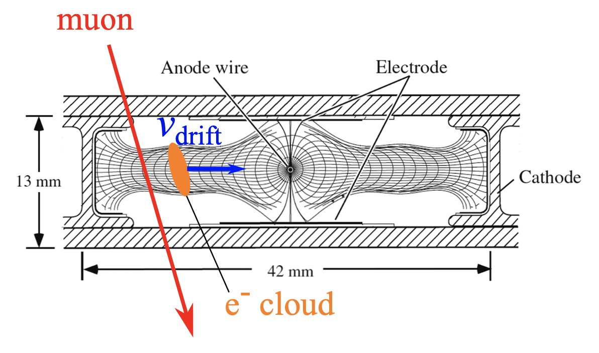

    <h1 style="font-size: 20px;">
        Final project for the <strong style="font-size: 26px;">Management and Analysis of Physics Datasets</strong> course 
        <strong style="font-size: 46px; display: block; margin-top: 20px;">Batch analysis of cosmic rays using Drift Tubes</strong>
    </h1>

    

        
    

    

        
    

    

        <!-- This space can remain empty if not needed -->
    

    

        
<strong style="font-size: 26px;">University of Padua - Department of Physics and Astronomy</strong>

        
<strong>Degree course:</strong> Physics of Data

        
<strong>Course:</strong> Management and Analysis of Physics Datasets

        
<strong>Year:</strong> 2023-2024

        
<strong>Professor in charge:</strong> Jacopo Pazzini

        <table style="margin: 0 auto; border-collapse: collapse; width: 80%; font-size: 16px;">
            <thead>
                <tr>
                    <th colspan="3" style="border: none; padding: 8px; text-align: center; font-weight: bold; font-size: 20px;">Students</th>
                </tr>
                <tr>
                    <th style="border: none; padding: 8px; text-align: left;">Name</th>
                    <th style="border: none; padding: 8px; text-align: left;">ID</th>
                    <th style="border: none; padding: 8px; text-align: left;">Email</th>
                </tr>
            </thead>
            <tbody>
                <tr>
                    <td style="border: none; padding: 8px;">Ada D'Iorio</td>
                    <td style="border: none; padding: 8px;">2092320</td>
                    <td style="border: none; padding: 8px;">ada.diorio@studenti.unipd.it</td>
                </tr>
                <tr>
                    <td style="border: none; padding: 8px;">Dario Liotta</td>
                    <td style="border: none; padding: 8px;">2124229</td>
                    <td style="border: none; padding: 8px;">dario.liotta.1@studenti.unipd.it</td>
                </tr>
            </tbody>
        </table>
    

# Introduction

A set of muon detectors have been built and installed in Legnaro INFN Laboratories (∼$10 \ km$ far from Padova) and are currently used to collect signals from cosmic rays. The working principles of these detectors (named mini Drift Tubes or miniDTs) are based on ionization: charged particles traversing the volume of the detectors will ionize the gas mixture inside, thus producing electron-ion pairs. Specifically shaped electric fields make the electron cloud travel throughout the volume with an almost constant drift velocity ($v_{drift} = 53.8 \ \mu m/ns$). Near the sensing anode wire, the electric field intensifies, leading to additional ionization and avalanche effects, thereby amplifying the signal.

Signals generated by ionization events are collected on the anodic wire, then amplified, digitized, discriminated, and transmitted through a Data Acquisition (DAQ) system.

Within the DAQ system, a series of Field Programmable Gate Arrays (FPGAs) perform Time-to-Digital Conversion (TDC), associating a digital signal with each electron cloud based on the time of collection.
Each digitized signal is commonly referred to as a "hit" representing an ionization event within the detector.

    

If the time of passage of the muon (usually referred to as $t_0$) is known, the TDC of a hit can be translated to a position inside the cell thanks to the constant $v_{drift}$, i.e:

$$ x_{hit} = (t_{hit}-t_0)v_{drift} $$

The time of passage of the muon is typically not known a priori and needs to be inferred from external information or geometrical considerations.
Additionally, there is an intrinsic left-right ambiguity associated with the time-to-space
conversion process. This means that the time information of a single hit is insufficient to
determine whether the muon passed through the right or left half of the cell.
To resolve this ambiguity and accurately reconstruct the trajectory of the muon, a full reconstruction of the track spanning multiple cells is required. By analyzing hits from multiple cells, it becomes possible to identify the track trajectory throughout one or more DT chambers and resolve the left-right ambiguity.

# Task 

Starting from the raw data collected by the DAQ of the detector, this project will require reconstructing the local and global track, relying on the external timing reference provided by the scintillator.
